# Manual: un pedido en mesa de principio a fin

Del QR de la mesa al cierre de caja: qué hace el cliente, cocina y barra, sala y encargado en cada momento.
Capturas reales del sistema (backend local de pruebas, `npm run dev:local`). La misma guía está en el panel: **/admin/manual** (botón ⓘ de la cabecera).

- [Antes de abrir: QR en cada mesa](#preparar)
- [1. El cliente escanea el QR](#escanear)
- [2. Elige los platos](#elegir)
- [3. Revisa y envía el pedido](#enviar)
- [4. Sigue su pedido en vivo](#seguimiento)
- [5. El local lo recibe](#recibir)
- [6. Cocina y barra lo preparan](#preparar-pedido)
- [7. Sala lo sirve en mesa](#servir)
- [Si el cliente pide al camarero](#comanda)
- [8. El cliente pide la cuenta](#cuenta)
- [9. Cobrar](#cobrar)
- [10. Recoger y dejar la mesa libre](#limpiar)
- [11. Cierre de caja](#cierre)

## Antes de abrir: QR en cada mesa

**Quién:** Encargado/a · **Dónde:** Mesas y QR → Imprimir QR

- Cada mesa tiene su propio QR. Imprímelos a escala 100 % y colócalos en su mesa (no los intercambies: el QR dice qué mesa pide).
- Si un QR se pierde o alguien lo fotografía para pedir desde fuera, regéneralo en Mesas y QR → QR de la mesa → «Regenerar» e imprime el nuevo.

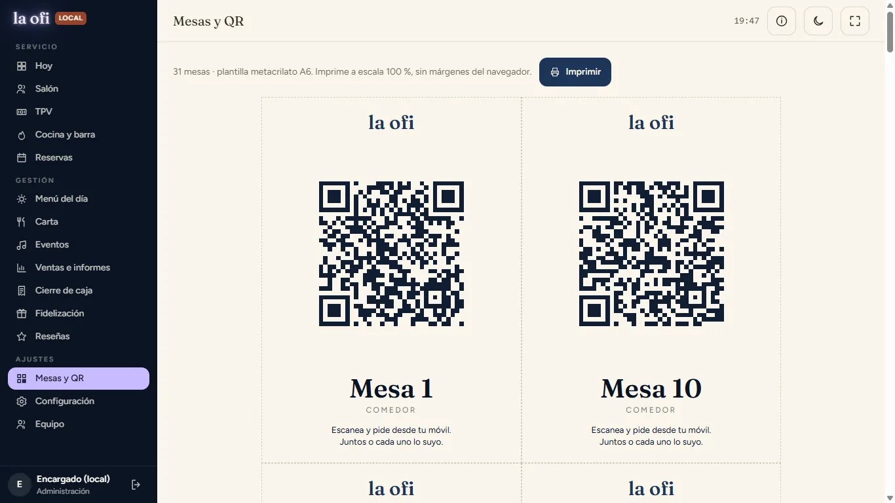

## 1. El cliente escanea el QR

**Quién:** Cliente · **Dónde:** Móvil del cliente

- Abre la cámara, escanea el QR y entra directamente en la carta de su mesa (sin instalar nada ni registrarse).
- La primera persona elige cómo pedir: «Todos juntos» (una sola cuenta) o «Cada uno lo suyo» (cada comensal pide y paga lo suyo).

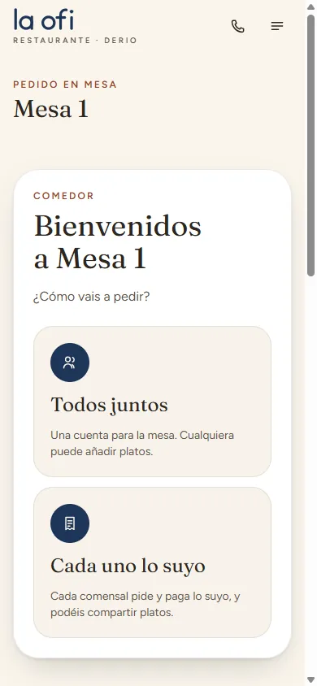

## 2. Elige los platos

**Quién:** Cliente · **Dónde:** Carta de la mesa

- Navega por categorías, busca o filtra por alérgenos y momento del día.
- Toca «Añadir» en cada plato; la barra inferior muestra cuántos lleva y el total.
- Arriba tiene siempre «Llamar al camarero» y «Cuenta».

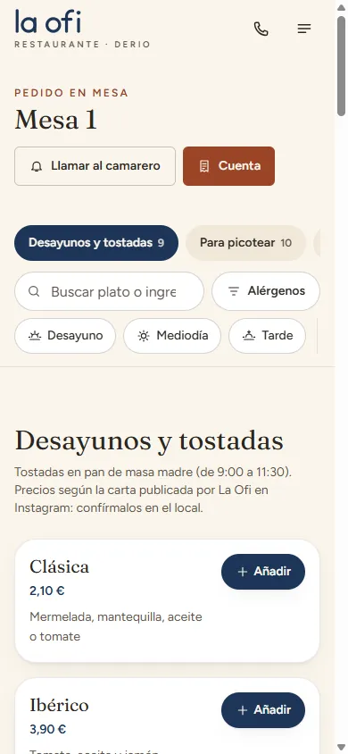
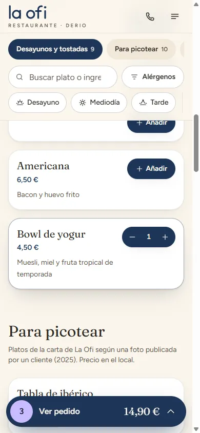

## 3. Revisa y envía el pedido

**Quién:** Cliente · **Dónde:** Ver pedido

- Ajusta cantidades, escribe notas para cocina (alergias, «sin miel», punto de la carne…) y elige cómo pagar.
- «Enviar pedido» lo manda al momento a cocina y barra. Puede volver a pedir más tarde las veces que quiera: todo suma a la misma mesa.

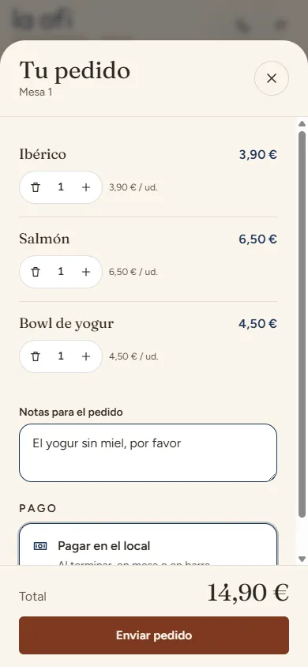

## 4. Sigue su pedido en vivo

**Quién:** Cliente · **Dónde:** Pantalla del pedido

- Ve el número de pedido y su estado: Recibido → Aceptado → En preparación → ¡Listo! → Entregado. Se actualiza solo.

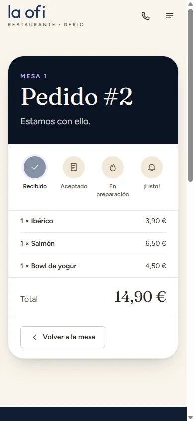
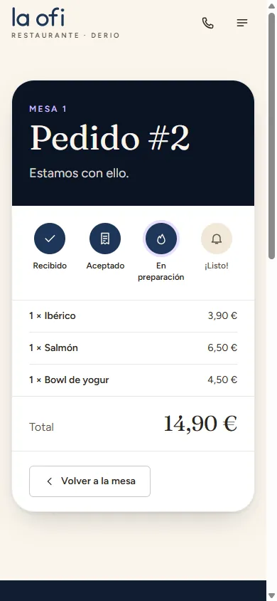

## 5. El local lo recibe

**Quién:** Sala · **Dónde:** Hoy · Cocina y barra

- En «Hoy» aparece en «Pedidos en marcha» y sube el contador «En cocina y barra» (con cuántos están sin aceptar).
- En la pantalla de Cocina y barra entra en «Nuevos» con la mesa, la hora, las notas y a qué estación va cada línea (COCINA o BARRA). Suena un aviso si el sonido está activado.

> 💡 En la tablet de cocina toca «Activar sonido» al empezar el turno: los navegadores no dejan sonar sin un primer toque.

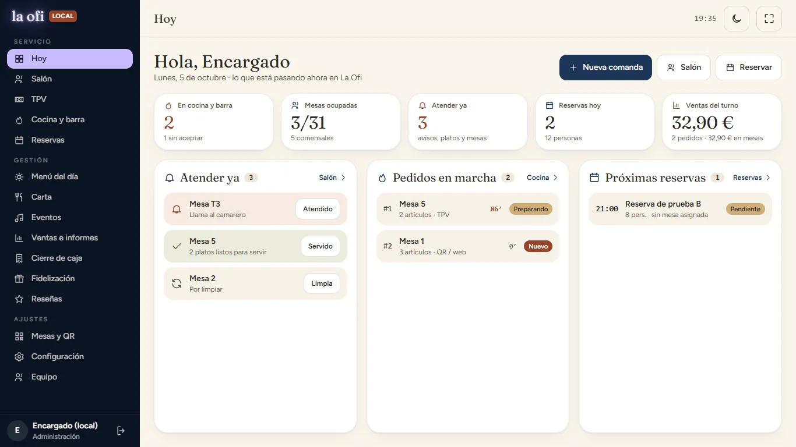
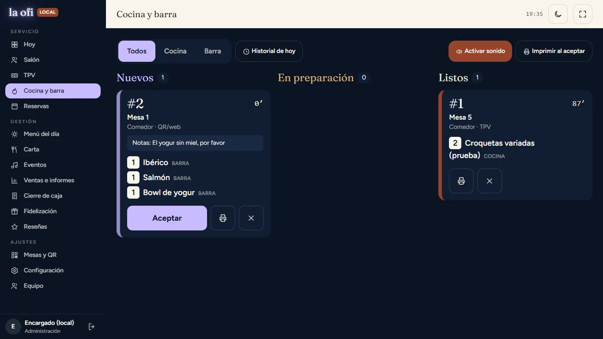

## 6. Cocina y barra lo preparan

**Quién:** Cocina y barra · **Dónde:** Cocina y barra

- «Aceptar» (se puede imprimir la comanda automáticamente con «Imprimir al aceptar»).
- «Empezar» cuando se pone en marcha y «Listo» cuando está para salir.
- Cocina y barra avanzan cada una sus líneas: el pedido no está listo hasta que ambas terminan. Usa las pestañas Cocina / Barra para ver solo lo tuyo.

> 💡 El tiempo de cada comanda se pone en rojo a partir de 20 minutos.

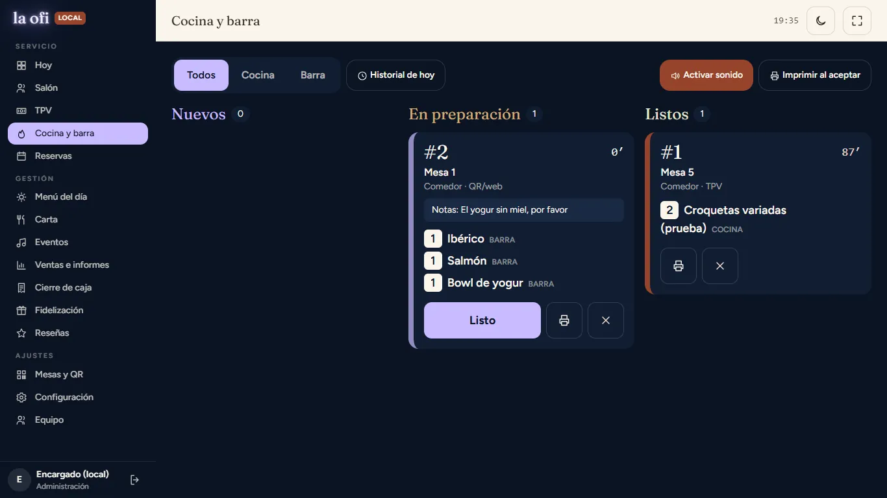
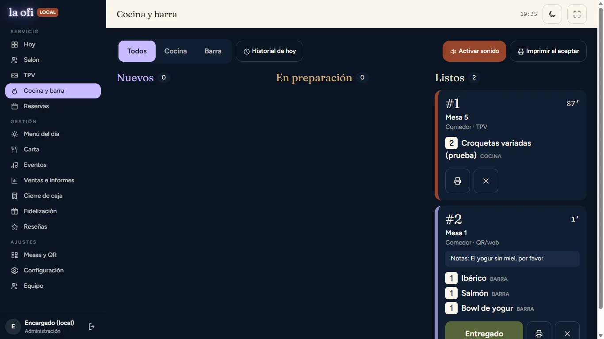

## 7. Sala lo sirve en mesa

**Quién:** Sala · **Dónde:** Hoy → Atender ya · Salón

- Cuando hay platos listos, la mesa aparece en «Atender ya» (en Hoy) y con un punto verde en el plano del Salón.
- Lleva los platos y pulsa «Servido» (en Hoy) o «Servir N platos listos» (en el Salón). El cliente ve «Entregado. ¡Que aproveche!».

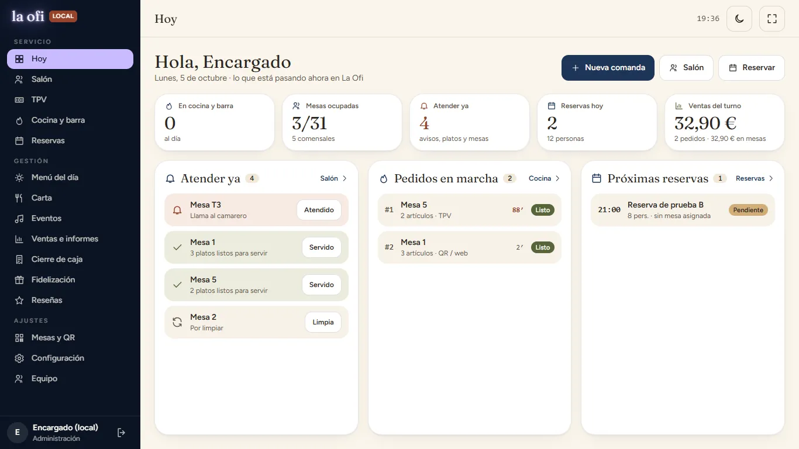
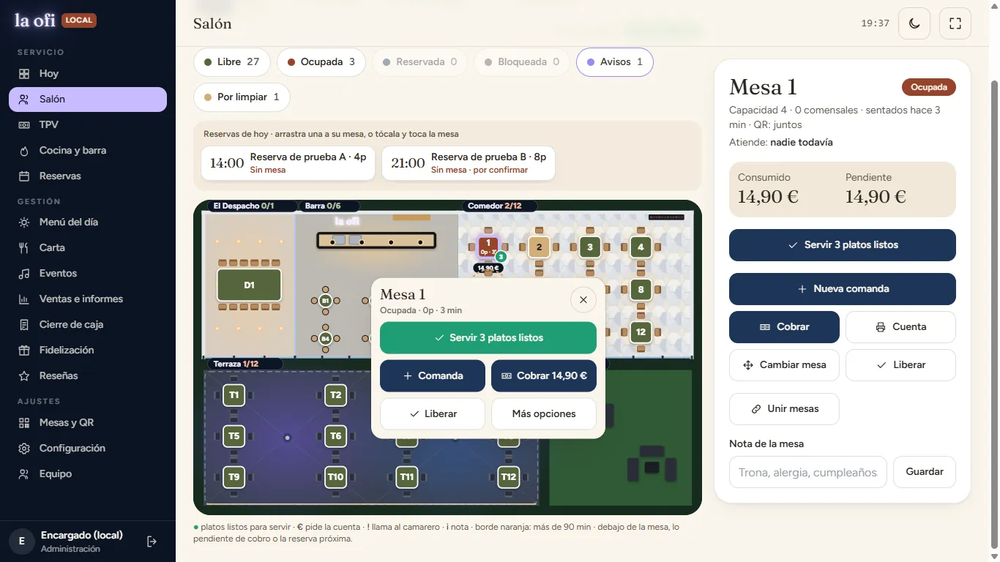
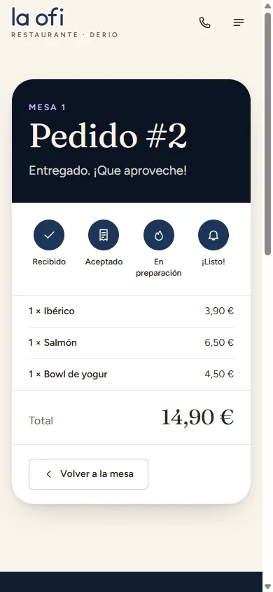

## Si el cliente pide al camarero

**Quién:** Sala · **Dónde:** Hoy → Nueva comanda · TPV

- No todo el mundo usa el QR. Toca la mesa en el Salón → «Nueva comanda» (o «Nueva comanda» en Hoy), elige mesa, añade productos y envía: entra en cocina y barra igual que un pedido QR.
- Las llamadas «Llamar al camarero» llegan a «Atender ya» con sonido; márcalas como «Atendido» al ir a la mesa.

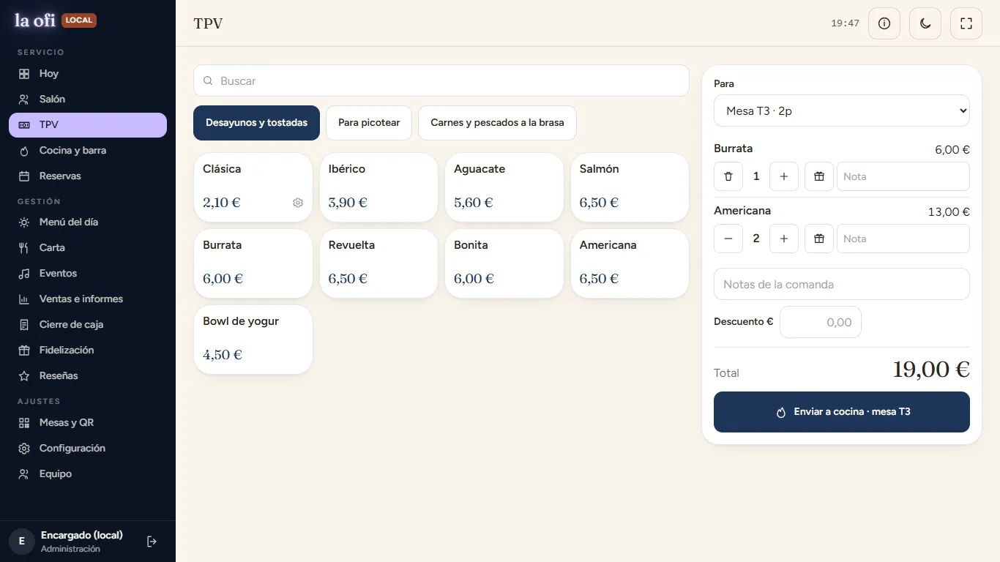

## 8. El cliente pide la cuenta

**Quién:** Cliente · **Dónde:** Cuenta (móvil)

- En «Cuenta» ve todo lo consumido por la mesa y toca «Pedir la cuenta» (en «cada uno lo suyo», cada comensal ve su parte y puede pagarla online si está activado).
- En el panel aparece en «Atender ya» como «Pide la cuenta» con el importe y un botón «Cobrar».

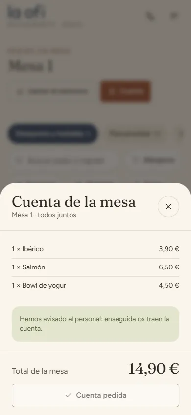
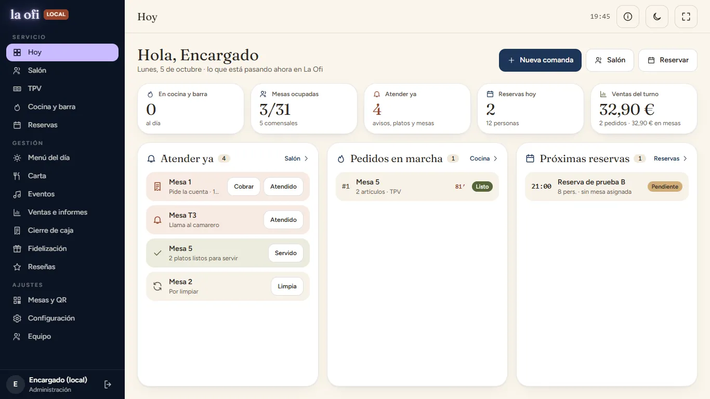

## 9. Cobrar

**Quién:** Sala · **Dónde:** Hoy → Cobrar · Salón → mesa → Cobrar

- «Cobrar» abre la mesa en el Salón. Usa «Cuenta» para imprimir el ticket si el cliente lo quiere en papel.
- En «Cobrar» elige Efectivo o Tarjeta. Si pagan a partes iguales, indica cuántos son y se cobra parte a parte. Con efectivo, escribe lo entregado y calcula el cambio.
- Con todo cobrado la mesa sigue abierta (pueden quedarse de sobremesa) y aparece en «Atender ya» como «Pagada». Cuando se vayan, pulsa «Liberar».

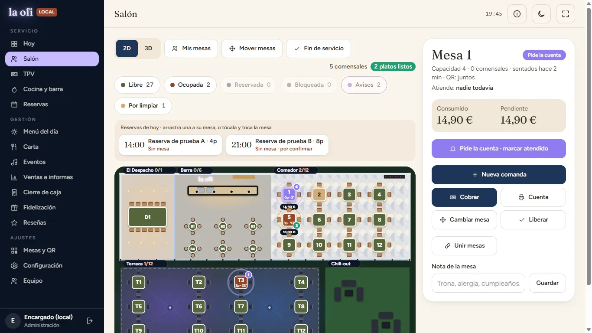
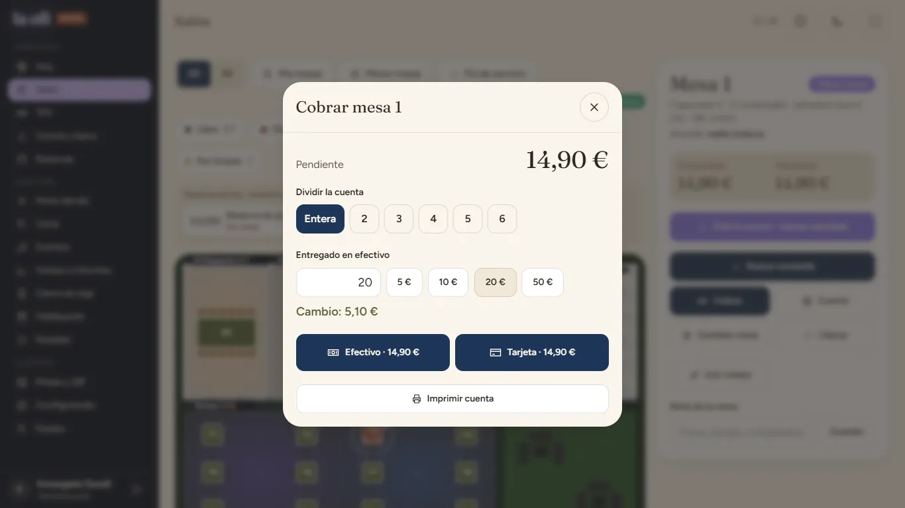

## 10. Recoger y dejar la mesa libre

**Quién:** Sala · **Dónde:** Hoy → Atender ya

- Al liberarla pasa a «Por limpiar». Cuando esté recogida pulsa «Limpia» y vuelve a verse libre (verde) en el plano, lista para los siguientes.

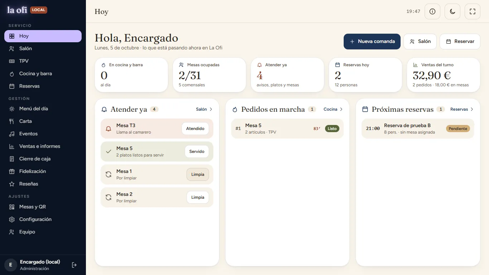

## 11. Cierre de caja

**Quién:** Encargado/a · **Dónde:** Cierre de caja

- Al terminar el turno revisa ventas por método de pago y lo pendiente de cobro (debe ser 0).
- Cuenta el efectivo, indica el fondo inicial y cierra: el sistema calcula el descuadre y guarda el cierre en el histórico.

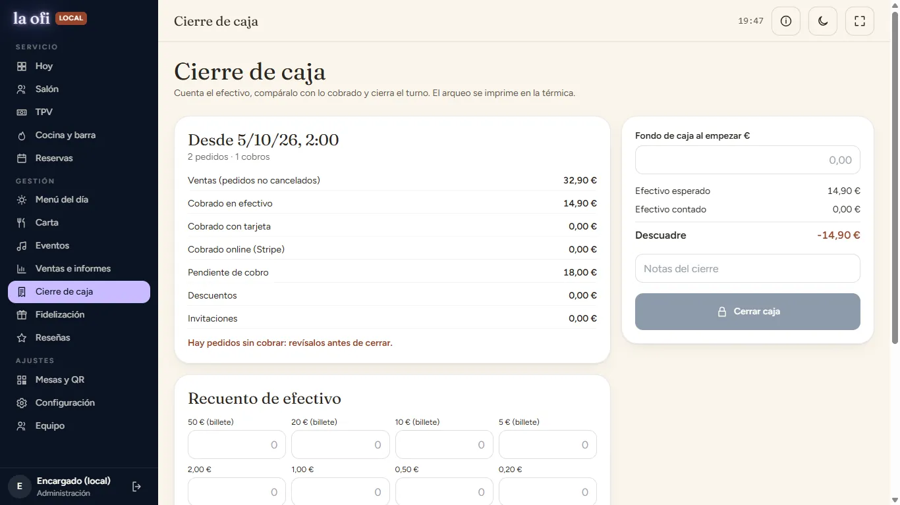

